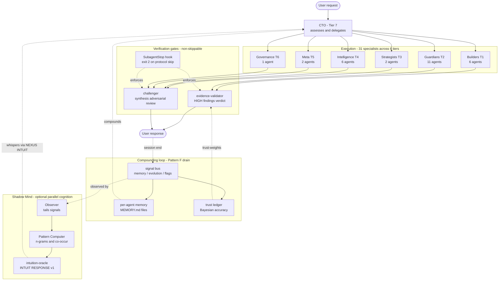
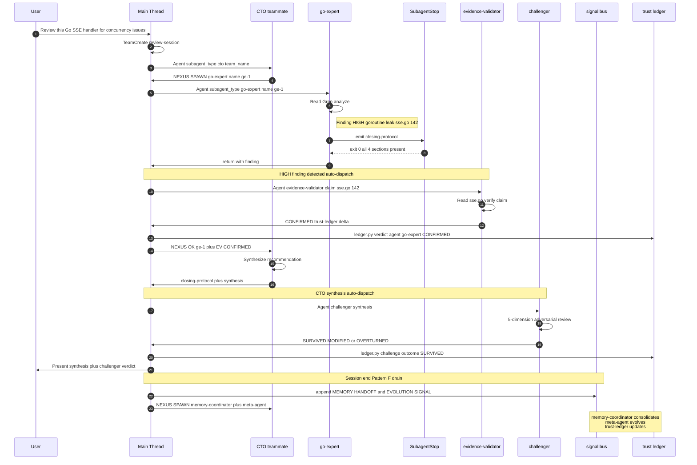
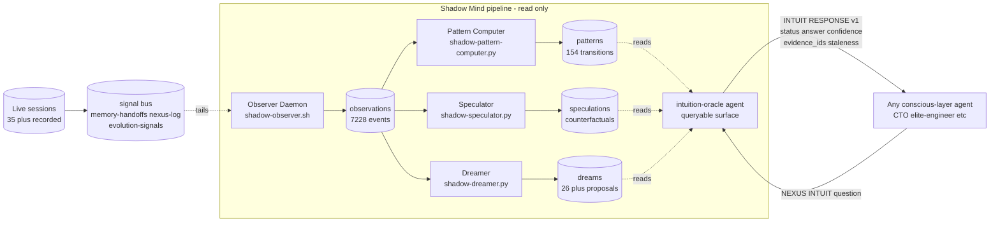

# Architecture Diagrams

Visual assets for the blog post and the X / LinkedIn / HN launch thread.

Each diagram is provided in **three formats**:

1. **Mermaid source** — the canonical, editable form. Renders natively on GitHub, dev.to, Medium (via Mermaid plugin), and any platform that supports Mermaid.
2. **ASCII-art fallback** — works everywhere (terminal, email, plain-text renderers). Use when Mermaid isn't available.
3. **PNG export** — generate from the Mermaid source when you need an image for X/Twitter, slides, or LinkedIn posts.

A **rendering cheatsheet** at the bottom of this file shows two ways to export Mermaid → PNG: (a) the free online Mermaid Live Editor (no install, drag-and-drop-ready) and (b) the `mmdc` CLI for reproducible exports in CI.

---

## Diagram 1 — "Hero": the dispatch-to-compounding loop

**Use for:** Tweet 1 of the X thread (attach as PNG). Also the blog-post hero image if you add one above `## The Problem With Single-Agent LLMs`.

**What it shows:** a single user request flowing through the team's four load-bearing structural features — orchestration (CTO), tiered specialization, the non-skippable verification gates, and the Pattern-F-driven compounding loop that makes the team smarter next session. Shadow Mind hovers below the conscious layer as the optional parallel cognition.

### Mermaid source (mermaid.live-compatible — paste directly)

> **To use dark theme:** paste the block below into <https://mermaid.live/>, then click the **Config** button in the toolbar and select a dark theme. Do NOT add a `%%{init:...}%%` directive — it breaks on mermaid.live.



### ASCII-art fallback

```
                        ┌──────────────────┐
                        │  👤 USER REQUEST  │
                        └────────┬─────────┘
                                 │
                    ┌────────────▼────────────┐
                    │   CTO · Tier 7           │
                    │   assesses & delegates   │
                    └────────────┬────────────┘
                                 │
   ┌──────────────┬─────────────┼──────────────┬─────────────┐
   │              │             │              │             │
┌──▼──┐      ┌────▼────┐   ┌────▼────┐   ┌────▼────┐   ┌───▼───┐
│ T1  │      │   T2    │   │   T3    │   │   T4    │   │ T5/T6 │
│ 6   │      │  11     │   │  2      │   │  6      │   │ 3     │
│Build│      │ Guard   │   │ Strat   │   │ Intel   │   │ Meta/ │
│     │      │         │   │         │   │         │   │ Gov   │
└──┬──┘      └────┬────┘   └────┬────┘   └────┬────┘   └───┬───┘
   │              │             │              │            │
   └──────────────┴─────────────┼──────────────┴────────────┘
                                │ findings · syntheses
                                │
            ┌───────────────────▼─────────────────────┐
            │     VERIFICATION GATES (Tier 8)          │
            │  ┌───────────────────────────────────┐  │
            │  │ evidence-validator                 │  │
            │  │   HIGH findings → CONFIRMED /      │  │
            │  │   PARTIAL / REFUTED / UNVERIFIABLE │  │
            │  ├───────────────────────────────────┤  │
            │  │ challenger                         │  │
            │  │   every CTO synthesis →            │  │
            │  │   5-dimension adversarial review   │  │
            │  └───────────────────────────────────┘  │
            │  ▲                                      │
            │  │ SubagentStop hook · exit 2           │
            │  │   blocks protocol-skipping agents    │
            └──┴───────────────────┬──────────────────┘
                                   │
                        ┌──────────▼──────────┐
                        │  ✅ USER RESPONSE    │
                        └──────────┬──────────┘
                                   │
                                   │ session-end signals
                                   ▼
         ┌─────────────────────────────────────────────┐
         │           signal bus (Pattern F drain)      │
         │  ┌──────────┐ ┌──────────┐ ┌──────────────┐│
         │  │ memory   │ │evolution │ │ trust ledger ││
         │  │handoffs  │ │signals   │ │ (Bayesian)   ││
         │  └────┬─────┘ └─────┬────┘ └──────┬───────┘│
         └───────┼─────────────┼─────────────┼────────┘
                 │             │             │
                 ▼             ▼             ▼
           per-agent     prompt edits  trust-weighted
           MEMORY.md     by meta-agent findings next
                                          session
                 │             │             │
                 └─────────────┼─────────────┘
                               │ ♻ compounds next session
                               │
                               └──────────────▶ (CTO)

 ═══════════════════════════════════════════════════════════════
     🌙  SHADOW MIND  — optional parallel cognitive layer
 ═══════════════════════════════════════════════════════════════
   Observer →  Pattern Computer  →  Pattern Library
   (tails      (n-grams +           (ngrams.json,
    signals)    co-occurrences +     co_occurrences.json,
                temporal)            temporal.json)
                                          │
                         ┌────────────────┴───────────────┐
                         ▼                                ▼
                    Speculator                       Dreamer
                   (counterfactuals)            (insight proposals)
                         │                                │
                         └──────────┬─────────────────────┘
                                    ▼
                         intuition-oracle
                   (INTUIT_RESPONSE v1 envelope:
                    status · answer · confidence ·
                    evidence_ids · staleness_hours)
                                    │
                                    │  whispers via
                                    │  [NEXUS:INTUIT]
                                    ▼
                               any agent (opt-in)
```

---

## Diagram 2 — The dispatch lifecycle (detailed flow for the blog body)

**Use for:** inline in the blog post between `Innovation 2: The NEXUS Syscall Protocol` and `Innovation 3: Dynamic Hiring`. Shows the full lifecycle of a single dispatch — from user input through NEXUS syscalls, hook enforcement, evidence validation, challenger gating, signal persistence, and the Pattern F drain.

### Mermaid source (mermaid.live-compatible — paste directly)



### ASCII-art fallback

```
USER                 MAIN-THREAD              CTO          SPECIALIST       VERIFIERS         BUS+LEDGER
 │                      │                      │                │                │                │
 ├──request─────────────▶                      │                │                │                │
 │                      │                      │                │                │                │
 │                      ├──TeamCreate──────────▶                │                │                │
 │                      │                      │                │                │                │
 │                      │         ◀────────────┤[NEXUS:SPAWN]   │                │                │
 │                      │                      │ go-expert      │                │                │
 │                      ├────Agent(go-expert)───────────────────▶                │                │
 │                      │                      │                ├──analyze       │                │
 │                      │                      │                ├──finding: HIGH │                │
 │                      │                      │                ├──closing proto │                │
 │                      │            (SubagentStop: exit 0)    │                │                │
 │                      ◀───────────────────────────────────────┤return          │                │
 │                      │                      │                │                │                │
 │                      │ HIGH detected → auto-dispatch:        │                │                │
 │                      ├────Agent(evidence-validator)──────────────────────────▶│                │
 │                      │                      │                │                ├──Read & verify │
 │                      ◀───────────────────────────────────────────────────────┤CONFIRMED       │
 │                      ├────ledger.py verdict──────────────────────────────────────────────────▶│
 │                      │                      │                │                │                │
 │                      ├──[NEXUS:OK]─────────▶│                │                │                │
 │                      │                      ├──synthesize    │                │                │
 │                      ◀──────────────────────┤synthesis       │                │                │
 │                      │                      │                │                │                │
 │                      │ CTO synthesis → auto-dispatch:        │                │                │
 │                      ├────Agent(challenger)──────────────────────────────────▶│                │
 │                      │                      │                │                ├──5-dim review  │
 │                      ◀───────────────────────────────────────────────────────┤SURVIVED        │
 │                      ├────ledger.py challenge────────────────────────────────────────────────▶│
 │                      │                      │                │                │                │
 ◀──synthesis + gate────┤                      │                │                │                │
 │                      │                      │                │                │                │
 │                      │ session end → Pattern F drain:        │                │                │
 │                      ├──[NEXUS:SPAWN] mc + ma────────────────────────────────────────────────▶│
 │                      │                      │                │                │                ├──consolidate
 │                      │                      │                │                │                ├──evolve
 │                      │                      │                │                │                ├──update weights
```

---

## Diagram 3 — Shadow Mind data flow (for blog Innovation 4)

**Use for:** inline in the blog post's Shadow Mind section (Innovation 4), near the "How an agent consults the Shadow Mind" subheading. Shows the six-component data pipeline from live-session observations to queryable `INTUIT_RESPONSE v1` envelopes.

### Mermaid source (mermaid.live-compatible — paste directly)



### ASCII-art fallback

```
    [Live sessions, 35+]          [signal bus: memory-handoffs,
            │                       nexus-log, evolution-signals,
            ▼                       cross-agent-flags, dispatch-queue]
    ┌───────────────┐                       │
    │  signal bus   │◀──── tails ───────────┘
    └───────┬───────┘
            │ (read-only, non-invasive)
   ═════════▼═══════════════════════════════════════════════════
   🌙  SHADOW MIND  —  parallel cognitive pipeline
   ═══════════════════════════════════════════════════════════════
            │
            ▼
   ┌────────────────┐
   │   Observer     │─────▶ observations/*.jsonl
   │   Daemon       │        (7,228 events captured)
   └────────┬───────┘
            │
   ┌────────┼────────────────────────────────────┐
   │        ▼                                    ▼
   │  ┌────────────────┐              ┌──────────────┐
   │  │ Pattern        │              │  Dreamer     │
   │  │ Computer       │              │              │
   │  └───────┬────────┘              └──────┬───────┘
   │          │                              │
   │          ▼                              ▼
   │  patterns/                        dreams/
   │  ├─ ngrams.json (154 transitions) ├─ *.yaml
   │  ├─ co_occurrences.json           └─ (26+ proposals)
   │  └─ temporal.json
   │
   │  ┌────────────────┐
   │  │  Speculator    │─────▶ speculations/*.json
   │  └────────────────┘        (counterfactual variants)
   │
   └──────────┬───────────────────────────────────────
              │
              ▼
    ┌──────────────────────────────┐
    │  intuition-oracle (AGENT)    │◀─── [NEXUS:INTUIT] question
    │  reads ALL 3 data sources    │      from any conscious agent
    └───────────┬──────────────────┘
                │
                ▼
     INTUIT_RESPONSE v1 envelope:
       • status (OK / INSUFFICIENT_DATA / SHADOW_MIND_STALE)
       • answer (structured, evidence-linked)
       • confidence (HIGH / MEDIUM / LOW / INSUFFICIENT_DATA)
       • evidence_ids (traceable back to observations/patterns/dreams)
       • staleness_hours (observer-heartbeat age)
                │
                ▼
          back to the requesting agent
          (never interrupts, never overrides)
```

---

## Rendering cheatsheet — Mermaid → PNG for X / LinkedIn

### Option A — Online (zero setup, 1 minute)

1. Open <https://mermaid.live/>
2. Paste the Mermaid source block from this file into the left pane
3. The right pane renders it live
4. Click **Actions → Download PNG** (or SVG for lossless scaling)
5. For X/Twitter: recommended card size is **1200 × 675 (16:9)**. If the diagram is taller than wide, use **1200 × 1500 (4:5 portrait)** — Twitter accepts both. Aim for ≥ 72dpi export at display size.
6. Upload PNG directly to the tweet / LinkedIn post / blog post.

### Option B — CLI for reproducible builds (2 min setup, repeatable)

```bash
npm install -g @mermaid-js/mermaid-cli

# Save each Mermaid block above as a .mmd file, then:
mmdc -i diagram-1-hero.mmd       -o diagram-1-hero.png       -w 1600 -H 900  -b dark
mmdc -i diagram-2-lifecycle.mmd  -o diagram-2-lifecycle.png  -w 1600 -H 1200 -b dark
mmdc -i diagram-3-shadow-mind.mmd -o diagram-3-shadow-mind.png -w 1600 -H 900 -b dark

# SVG (for lossless embedding / retina displays):
mmdc -i diagram-1-hero.mmd -o diagram-1-hero.svg -b dark
```

**Dark-theme reminder:** all three Mermaid sources ship with a dark `themeVariables` block. If you prefer light-theme renders (for a white-background blog or LinkedIn), delete the `%%{init: ...}%%` front-matter line and pass `-t default` to `mmdc`.

### Option C — GitHub / dev.to / Medium (inline Markdown embed)

GitHub, dev.to, GitLab, and most modern Markdown renderers support Mermaid natively. You can paste the Mermaid source blocks from this file **directly** into the blog post Markdown and they'll render in place — no PNG export needed. Medium requires the [Mermaid plugin](https://medium.com/@yvesonline/medium-and-diagrams-mermaid-e4dc05cb4e1d) (or embed the PNG).

For the HN submission, the URL will point at the repo (`[REPO_LINK]`), not the blog. HN doesn't render inline images anyway — the PNG attachment is for X and LinkedIn only.

---

## Which diagram goes where

| Destination | Diagram to use |
|---|---|
| **Tweet 1 (X thread hook)** | Diagram 1 — Hero (PNG, 1200×675) |
| **LinkedIn post hero image** | Diagram 1 — Hero (PNG or SVG) |
| **Blog post hero** (above the fold) | Diagram 1 — Hero (inline Mermaid or PNG) |
| **Blog body — Innovation 2: NEXUS** | Diagram 2 — Dispatch lifecycle |
| **Blog body — Innovation 4: Shadow Mind** | Diagram 3 — Shadow Mind data flow |
| **HN submission** | None (text-only; let the blog do the visual work) |
| **README.md** | Consider embedding Diagram 1 near the top — makes the repo's architecture graspable in 10 seconds on first visit |

---

## Editing discipline

- All three diagrams are **source-of-truth in this file**. If the architecture changes, edit here first, then re-render the PNGs.
- Keep the Mermaid blocks in sync with the ASCII fallbacks when you edit. The ASCII version is what survives in text-only contexts (email, terminal, plain-text RSS, etc.).
- The Shadow Mind diagram has a subtle visual convention: dashed borders mean "data file on disk," solid borders mean "running process." Preserve that convention if you add components.
- The Hero diagram's node counts (Tier 1 = 6, Tier 2 = 11, etc.) are current as of **2026-04-21**. If the roster changes via the hiring pipeline, update the numbers.
