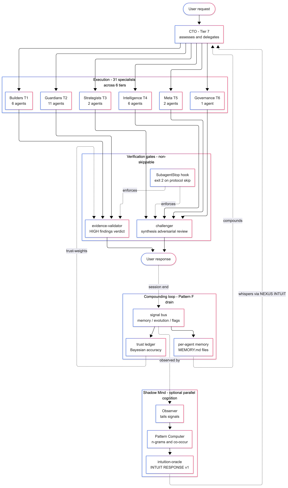

# Claude Code 32-Agent Team

> A production-grade multi-agent engineering team for Claude Code, with hook-enforced protocol, adversarial review, Bayesian trust calibration, dynamic specialist hiring, an optional parallel cognitive layer, and a self-improving meta-cognitive loop.



**Architecture diagrams:** [`ARCHITECTURE_DIAGRAMS.md`](ARCHITECTURE_DIAGRAMS.md) (editable Mermaid source + ASCII fallbacks + PNG export instructions)

This is not a framework. It's an **operating system layer on top of Claude Code** — 32 domain-expert agents coordinated through a syscall protocol (NEXUS), governed by runtime hooks, validated by a 352-assertion contract test suite, calibrated by a per-agent trust ledger, and equipped with a gated hiring pipeline for growing the roster as coverage gaps appear.

**What it actually is** (verified against itself):
- 32 agent definitions in `agents/` (each 20–56 KB of role-specific instructions, spanning Go / Python / TypeScript / Elixir / BEAM / K8s / GCP / security / QA / AI platform / external BEAM retainer / recruiting + team-evolution roles)
- Runtime hooks that enforce closing-protocol invariants, persist signals, auto-log syscalls, auto-record trust verdicts, and gate post-hire registration
- A signal bus (`agent-memory/signal-bus/`) that carries memory/evolution/cross-agent flags between sessions
- A trust ledger (`agent-memory/trust-ledger/`) that Bayesian-blends per-agent accuracy from validator verdicts
- A documented NEXUS syscall protocol for privileged operations (SPAWN, SCALE, RELOAD, MCP, ASK, CRON, INTUIT, etc.)
- A **Dynamic Domain Expert Acquisition** pipeline (`talent-scout` + `recruiter`) — the team detects its own coverage gaps (5-signal confidence score + session-sentinel co-sign) and hires new specialist agents through 8 gated phases (research → synthesis → validation → challenger review → atomic registration → post-hire verify → probation → promotion)
- An optional **Shadow Mind** cognitive layer (`intuition-oracle` + Observer + Pattern Computer + Speculator + Dreamer + Pattern Library) that offers probabilistic pattern-based guidance via `[NEXUS:INTUIT]`, with **topic cluster pattern retrieval** ("have we seen this before? what fixed it?"), **delete-to-disable** without affecting the conscious team
- **Execution modes** (FAST / BALANCED / FULL_POWER) for speed/cost/quality trade-offs per task
- **6-state agent lifecycle** (candidate → probationary → active → trusted → deprecated → retired) with trust-weighted routing preference
- **Quality gates by task type** — different workflows for code changes vs security findings vs architecture decisions vs incidents
- **Conflict arbitration protocol** — structured evidence-based dispute resolution when agents disagree
- **nexus-doctor.sh** — diagnostic health check for framework integrity (agents, hooks, dependencies, Shadow Mind status)
- **Planning cache (playbooks)** — reusable task workflows that make repeated task types faster over time
- Contract tests (`tests/agents/`) that run on every commit and gate prompt evolution

---

## Why this exists

Most agentic frameworks try to enforce discipline **inside the agent loop** (via code wrapping the model). This team enforces it **below the agents** (via hooks at the Claude Code runtime layer). That's structurally better: agents cannot talk their way past a `SubagentStop` hook the way they can talk their way past a Python `try/except`.

The team's value proposition splits cleanly:
- **Methodology layer** (NEXUS + signal bus + validator gate + challenger gate + trust ledger + Pattern F + hiring pipeline + Shadow Mind): *domain-agnostic*, transfers to any engineering work
- **Expertise layer** (32 agent prompts covering Go / Python / TypeScript / Elixir / BEAM / K8s / GCP / security / QA / AI platform / etc.): extend or customize for your stack — or let the hiring pipeline add specialists as gaps appear

---

## Installation

```bash
# 1. Copy the team into your project
cp -R claude-nexus-hyper-agent-team/agents           YOUR_PROJECT/.claude/agents/
cp -R claude-nexus-hyper-agent-team/hooks            YOUR_PROJECT/.claude/hooks/
cp -R claude-nexus-hyper-agent-team/tests            YOUR_PROJECT/.claude/tests/
cp -R claude-nexus-hyper-agent-team/docs             YOUR_PROJECT/.claude/docs/
cp -R claude-nexus-hyper-agent-team/agent-memory     YOUR_PROJECT/.claude/agent-memory/
cp    claude-nexus-hyper-agent-team/settings.json    YOUR_PROJECT/.claude/settings.json
cp    claude-nexus-hyper-agent-team/CLAUDE.md        YOUR_PROJECT/CLAUDE.md

# 2. Verify installation
python3 YOUR_PROJECT/.claude/tests/agents/run_contract_tests.py
# Expected: 352 passed, 0 failed

# 3. Optional — install the git pre-commit hook for agent contract tests
ln -s ../../.claude/hooks/pre-commit-agent-contracts.sh YOUR_PROJECT/.git/hooks/pre-commit
```

### After install

1. Open `CLAUDE.md` at your project root and fill in the `## Project-Specific Context` section at the bottom (architecture overview, development commands, environment variables, deployment notes).
2. Replace the `<placeholder>` tokens with your project's specifics:
   - `<your project>` → your project name
   - `<your-project>` → your project slug
   - `<go-service>` → your Go service name (or remove if not applicable)
   - `<python-service>` → your Python service name (or remove if not applicable)
   - `<frontend>` → your frontend package name (or remove if not applicable)
   - `<project-slug>` → a filesystem-safe slug for your project
3. Start your first session — say `"use the team, <goal>"` and Claude Code will dispatch the CTO.

### Customizing the roster

The 32 agents cover: Go, Python, TypeScript, React/Next.js, Elixir, BEAM/OTP, Kubernetes, GCP, Terraform, PostgreSQL, Redis, Firestore, GraphQL, security, observability, testing, AI/ML architecture, benchmarking, and external BEAM retainer advisory. **If you work on a different stack** (e.g., Rust, embedded, kernel, ML training, AWS-native), you have two paths:

**Path A — Let the team hire for you (recommended):** Dispatch `talent-scout` for a coverage audit; if it detects a recurring gap with ≥0.70 confidence AND `session-sentinel` co-signs, dispatch `recruiter` to run the 8-phase pipeline. `meta-agent` performs atomic registration (agent file + contract-test list + hook regexes + trust-ledger default + memory scaffold) in a single commit, gated by `post-hire-verify.sh`.

**Path B — Manual add:**
1. Add a new agent file to `agents/` (follow existing structure — frontmatter with `name`, `description`, `model` + body with the mandatory sections). Use `docs/team/AGENT_TEMPLATE.md` as a scaffold.
2. Add the agent name to `tests/agents/run_contract_tests.py:CUSTOM_AGENTS` + the regex in the hooks
3. Reference it in `CLAUDE.md`'s dispatch table
4. Run the contract tests — they'll validate your new agent
5. Run `bash hooks/post-hire-verify.sh <agent-name>` to confirm atomic registration

---

## How it works — 60-second tour

### The 8-tier architecture

```
TIER 1 — BUILDERS      elite-engineer, ai-platform-architect, frontend-platform-engineer,
                        beam-architect, elixir-engineer, go-hybrid-engineer
TIER 2 — GUARDIANS     go-expert, python-expert, typescript-expert, deep-qa, deep-reviewer,
                        infra-expert, database-expert, observability-expert, test-engineer,
                        api-expert, beam-sre, code-sentinel
TIER 3 — STRATEGISTS   deep-planner, orchestrator
TIER 4 — INTELLIGENCE  memory-coordinator, cluster-awareness, benchmark-agent,
                        erlang-solutions-consultant, talent-scout, intuition-oracle
TIER 5 — META          meta-agent, recruiter
TIER 6 — GOVERNANCE    session-sentinel
TIER 7 — CTO           cto
TIER 8 — VERIFICATION  evidence-validator, challenger
```

### The session lifecycle (Pattern A–F)

- **Pattern A** — incident / P0 debugging (CTO + cluster-awareness + relevant language expert + deep-reviewer)
- **Pattern B** — planned build (deep-planner → orchestrator → builders → reviewers → QA)
- **Pattern C** — code review only (deep-qa + deep-reviewer + language expert, parallel)
- **Pattern D** — refactor (deep-planner → elite-engineer → deep-qa validates)
- **Pattern E** — test campaign (test-engineer designs → elite-engineer executes)
- **Pattern F** — session-end learning drain (memory-coordinator + meta-agent, parallel)

### The verification gates (non-negotiable)

1. **Closing protocol** — every agent returns with 4 mandatory sections (MEMORY HANDOFF, EVOLUTION SIGNAL, CROSS-AGENT FLAG, DISPATCH RECOMMENDATION); enforced by `verify-agent-protocol.sh` with `exit 2`
2. **Evidence validation** — every HIGH/CRITICAL finding is routed to `evidence-validator` before reaching the user; verdicts auto-record to the trust ledger
3. **Adversarial review** — every CTO synthesis / strategic recommendation goes through `challenger` before surfacing
4. **Pattern F drain** — every session ends with memory-coordinator + meta-agent processing the signal bus, baking new lessons into prompts

### The NEXUS syscall protocol

Teammates don't have the `Agent` tool (privileged operation). When they need to spawn another agent, install an MCP, ask the user a question, schedule a cron job, open a worktree, or **query the Shadow Mind's pattern library for probabilistic guidance**, they send a `[NEXUS:*]` message via SendMessage to `"lead"`. The main thread (kernel) processes the syscall and responds `[NEXUS:OK|ERR]`. Full syscall table (including `[NEXUS:INTUIT]`) is in `CLAUDE.md`.

### The hiring pipeline (Capability 1)

The team can detect its own coverage gaps and hire new specialist agents. When `talent-scout`'s continuous audit yields a requisition with confidence ≥0.70 AND `session-sentinel` co-signs (both must agree), `recruiter` runs the 8-phase pipeline: research (benchmark-agent) → synthesis (draft using `AGENT_TEMPLATE.md`) → validation (contract tests) → challenger (adversarial review of the draft) → handoff to meta-agent → atomic registration (single commit across agent file + contract-test list + hook regexes + trust ledger + memory scaffold) → `post-hire-verify.sh` gate → probation tracking → promotion on refutation rate <25% across ≥5 verdicts. **The team grows when evidence supports growth.**

### The Shadow Mind (parallel cognitive layer — production-validated, disable-able)

A non-invasive parallel cognitive layer that runs alongside the conscious team. Six components: Observer daemon (`shadow-observer.sh` — tails signal bus with resolution tracking), Pattern Computer (`shadow-pattern-computer.py` — derives n-grams + co-occurrences + temporal patterns + **topic clusters** with fix history), Pattern Library (read-only data), Speculator (counterfactual variants), Dreamer (insight candidates during idle windows), and `intuition-oracle` agent (the queryable surface with 6 intent types including **PATTERN_RETRIEVAL** — "have we seen this failure before? what fixed it?"). Agents can OPTIONALLY consult it via `[NEXUS:INTUIT] <question>` and receive an `INTUIT_RESPONSE v1` envelope with a confidence score and evidence IDs.

**Production telemetry (2026-04-21):** Observer captured 7,228 observations and stays fresh (< 2h heartbeat). Pattern Computer derived 154 transitions across 35 sessions. Oracle queries return structured MEDIUM/HIGH confidence on in-domain questions and correctly return `INSUFFICIENT_DATA` when the Pattern Library has not yet seen enough of a domain. Three real oracle consultations during 2026-04 sessions produced actionable findings that shaped challenger-gate scope.

**Delete `agent-memory/shadow-mind/` and the layer is gone** — no conscious-layer agent is required to consult it, and all 352/352 contract tests continue to pass either way.

---

## The self-improvement loop

Every session produces four signals: memory handoffs, evolution recommendations, cross-agent flags, dispatch chains. At session end (Pattern F):

1. `memory-coordinator` consolidates durable learnings into per-agent memory files
2. `meta-agent` reads the evolution-signals queue and edits agent prompts to bake in new patterns
3. `evidence-validator` verdicts update the trust ledger via the `auto-record-trust-verdict.sh` hook
4. Contract tests re-run to ensure no regressions

The team is **measurably smarter next session than this session**. That's the compounding property single-agent setups structurally lack.

---

## What's intentionally NOT included

- **`agent-memory/*/` is empty** — each agent's memory starts fresh. Memory builds organically from your project's own sessions.
- **`trust-ledger/*.json` is empty** — trust calibration starts at 0.9 default prior for all agents. Real weights accumulate as `evidence-validator` issues verdicts.
- **`signal-bus/*.md` is drained** — the bus starts empty (Pattern F end-state). First session's outputs populate it.
- **No project-specific context in `CLAUDE.md`** — the team protocol is generic; project context is your job to fill in.

---

## Directory structure

```
claude-nexus-hyper-agent-team/
├── CLAUDE.md                         # Team operating protocol + project context stub
├── README.md                         # This file
├── LICENSE
├── agents/                           # 32 agent definitions (YAML frontmatter + markdown body)
├── hooks/                            # Runtime hooks + Shadow Mind scripts
│   ├── verify-agent-protocol.sh      # SubagentStop — blocks bad closing protocols
│   ├── verify-signal-bus-persisted.sh # SubagentStop — warns on signal persistence drift
│   ├── auto-record-trust-verdict.sh  # SubagentStop — records validator verdicts
│   ├── log-nexus-syscall.sh          # PostToolUse — logs NEXUS syscalls
│   ├── pre-commit-agent-contracts.sh # git pre-commit — runs contract tests
│   ├── post-hire-verify.sh           # hiring-pipeline gate — atomic-registration check
│   ├── shadow-observer.sh            # Shadow Mind — Observer daemon (optional)
│   ├── shadow-pattern-computer.py    # Shadow Mind — Pattern Computer (optional, cron)
│   ├── shadow-speculator.py          # Shadow Mind — counterfactual variants (optional, cron)
│   └── shadow-dreamer.py             # Shadow Mind — insight proposer (optional, daily cron)
│   └── nexus-doctor.sh               # Framework health check diagnostic
├── tests/agents/
│   └── run_contract_tests.py         # 11 contracts × 32 agents = 352 assertions
├── docs/team/                        # Team documentation (overview, cheatsheet, runbook, scenarios, AGENT_TEMPLATE)
├── agent-memory/                     # Per-agent memory + signal bus + trust ledger + Shadow Mind
│   ├── <agent-name>/MEMORY.md        # Empty scaffold per agent
│   ├── signal-bus/                   # Header-only files, drained to Pattern F baseline
│   ├── shadow-mind/                  # Shadow Mind data (optional, delete-to-disable)
│   └── trust-ledger/
│       ├── ledger.py                 # CLI: verdict, challenge, show, weight, standings, promote, retire, deprecate
│       └── README.md                 # Schema + usage
├── agent-memory/routing/
│   └── task-classifier.json          # Task type → execution mode dispatch matrix
├── agent-memory/playbooks/
│   └── README.md                     # Reusable task workflow protocol
├── settings.json                     # Claude Code hook wiring (required)
└── settings.local.json               # Per-user overrides (meant to be .gitignored)
```

---

## Prerequisites

- **Claude Code CLI v2.1.32+** (required for team-mode NEXUS syscalls via the [agent-teams](https://code.claude.com/docs/en/agent-teams) feature). Earlier versions can still run the team in one-off mode only.
- Python 3.8+ (for contract tests + trust ledger)
- `jq` (for hooks that parse JSON from Claude Code)
- Unix shell (bash/zsh) — hooks use POSIX-compatible shell scripts
- `CLAUDE_CODE_EXPERIMENTAL_AGENT_TEAMS=1` enabled in `settings.json` to activate team-mode NEXUS. See [Anthropic's official agent-teams docs](https://code.claude.com/docs/en/agent-teams) for current status.

---

## License

MIT — see `LICENSE` file.

## Production Telemetry (2026-04-21, 5 weeks of continuous operation)

> Measured on our private production instance. This data is **stripped from the distribution** (see "What's intentionally NOT included") — the figures below evidence how the framework behaved in real use; they are **not** reproducible from this repo.

| Signal | Observed |
|---|---|
| Trust-ledger verdicts | **67 evidence-validator verdicts across 13 agents.** 3 REFUTED (validator is catching real mistakes, not rubber-stamping). go-expert: 15/1/0 → trust 0.952. |
| Challenger activity | 10 real challenges issued, including 4 against CTO's own syntheses. |
| Hiring pipeline | Ran end-to-end on 2026-04-19 for `elixir-kernel-engineer`; probation dispatches pending. |
| Shadow Mind | Observer 7,228 observations captured (heartbeat < 2h). Pattern Computer 154 transitions across 35 sessions. Oracle returning structured MEDIUM/HIGH confidence on in-domain questions; correctly `INSUFFICIENT_DATA` on under-observed domains. |
| Signal bus | 506 entries (~100/week): 138 memory-handoffs, 126 NEXUS syscalls, 59 cross-agent flags, 35 evolution signals. |
| Contract tests | 352/352 passing on every commit. |

## Built by

| | Name | Role | Links |
|---|---|---|---|
|  | **Sherief Attia** | CTO & Co-founder | [LinkedIn](https://www.linkedin.com/in/sheriefattia/) / [GitHub](https://github.com/SheriefAttia) |
|  | **Khaled El Azab** | Chief of AI Strategies & Co-founder | [LinkedIn](https://www.linkedin.com/in/ikhaled-elazab/) / [GitHub](https://github.com/shw2ypro) |
|  | **Hossam Hegazy** | Chief of Engineering & Co-founder | [LinkedIn](https://www.linkedin.com/in/hossam-hegazy-269745a4/) |

Built while building [**ASIFlow**](https://asiflow.ai) — a sovereign AI agent platform for regulated industries. The methodology generalizes to any engineering domain; the 32 agent domain specializations reflect the original platform's stack, and `talent-scout` + `recruiter` exist so the roster can grow to match yours.

## Contributing

- New agents: follow the existing frontmatter schema; contract tests will validate
- Hook improvements: keep hooks POSIX-compatible; use `$CLAUDE_PROJECT_DIR` for paths
- Pattern additions: update `CLAUDE.md` dispatch table + `docs/team/TEAM_RUNBOOK.md`

## Known Limitations

### From Anthropic's agent-teams feature (verified against [official docs](https://code.claude.com/docs/en/agent-teams))

1. **Agent teams is an experimental Claude Code feature.** Per Anthropic: *"Agent teams are experimental and disabled by default. Enable them by adding `CLAUDE_CODE_EXPERIMENTAL_AGENT_TEAMS` to your settings.json or environment. Agent teams require Claude Code v2.1.32 or later."*
   Impact for this team: the NEXUS syscall protocol (team-mode dispatch via `TeamCreate` + `SendMessage` to `"lead"`) depends on this feature.
   Fallback: **one-off mode** (Agent tool + `### DISPATCH RECOMMENDATION` text signals) does NOT depend on agent-teams and works on stable Claude Code. You can run the team in one-off mode permanently, accepting slower coordination vs. real-time syscalls.

2. **No session resumption for in-process teammates** (per Anthropic docs).
   `/resume` and `/rewind` do not restore teammates. After resuming a long session, the lead may attempt to message teammates that no longer exist. Mitigation: persist important findings to `agent-memory/` before long pauses; re-dispatch teammates fresh after resumption.

3. **One team per session, no nested teams** (per Anthropic docs).
   The lead can only manage one team at a time. Teammates cannot spawn their own teams. Clean up the current team before starting a new one. Mitigation: for workflows that conceptually need sub-teams (e.g., "review team" + "build team"), model them as one flat team with role-named teammates (e.g., `reviewer-1`, `reviewer-2`, `builder-1`).

### From this team's own scope

4. **Domain coverage is web/cloud/AI-platform/BEAM-focused.** The 32 agents cover Go, Python, TypeScript, Elixir, BEAM/OTP, Kubernetes, GCP, GraphQL, PostgreSQL, Redis, Firestore, and AI/ML platform work. For embedded firmware, OS kernels, compilers, DSP, crypto primitives, AWS-native, or formal verification, you'll want to add domain-specialist agents — the harness supports it via the hiring pipeline (see `Customizing the roster` above); the existing prompts don't cover these domains.

5. **N=1 by codebase, N=15 by domain — with per-agent depth transparency.** The team was developed and refined against a single production codebase over 5 weeks (2026-03-18 through 2026-04-21). Multi-codebase, multi-language, multi-team behavior is unproven. However, within that single codebase the team exercised ~15 technical domains at substantial depth. **In our private production instance** (this data is stripped from the distribution — see "What's intentionally NOT included"), the per-agent memory and trust ledger showed where validation was deep vs. thin. Deep: `go-expert` (132 KB, 16 verdicts, trust 0.952), `infra-expert` (240 KB), `api-expert` (524 KB), `database-expert` (260 KB), `cluster-awareness` (168 KB). Thin: `python-expert` (12 KB, 1 file). Expect sharper edges on thin-data domains until your sessions populate those agents' records.

6. **Opus-heavy — 27 of 32 agents default to opus.** Not affordable for all plans. Five agents (`session-sentinel`, `evidence-validator`, `challenger`, `intuition-oracle`, `talent-scout`) default to sonnet because they're structured-reasoning, verification, and advisory roles where sonnet is sufficient. Language experts and `deep-qa`/`deep-reviewer` should NOT be downgraded without explicit cost/quality trade-off acceptance — their false-negative rate on sonnet is expensive.

7. **Trust ledger starts uncalibrated.** Every agent begins at the 0.9 Bayesian prior with zero verdicts. Real calibration emerges as `evidence-validator` issues verdicts during actual sessions. Expect 5–10 sessions before per-agent trust weights carry meaningful signal. Until then, CTO synthesis weights all agents equally.

8. **Total agent prompt size scales with roster.** Loaded once per Claude Code session. Cost scales with session activity (number of tool calls, agent dispatches), not with prompt size. Still, for cost-sensitive deployments, audit which agents you actually need and trim the roster (or rely on talent-scout to keep it lean — it only adds agents when evidence-gated).

9. **Experimental-feature tracking burden.** If you rely on team-mode NEXUS, you're coupled to Anthropic's evolution of the agent-teams feature. Breaking changes to `TeamCreate` or `SendMessage` semantics will break team-mode syscalls. Mitigation: pin a Claude Code version, test upgrades in a throwaway project before rolling out, and keep one-off mode paths working as a fallback.

10. **Shadow Mind requires ongoing data curation.** If you enable the Shadow Mind, Observer must keep tailing the signal bus (`heartbeat < 24h`) or the oracle returns `SHADOW_MIND_STALE`. The Pattern Computer / Speculator / Dreamer crons should be scheduled via `CronCreate` (see `docs/team/TEAM_RUNBOOK.md` for activation commands). If you don't enable it, the team operates identically without it — the Shadow Mind is strictly additive.

---

*Last updated: 2026-05-22. Team v3.2 — 32 agents, execution modes, 6-state lifecycle, quality gates by task type, conflict arbitration, topic clusters, nexus-doctor, playbooks.*
